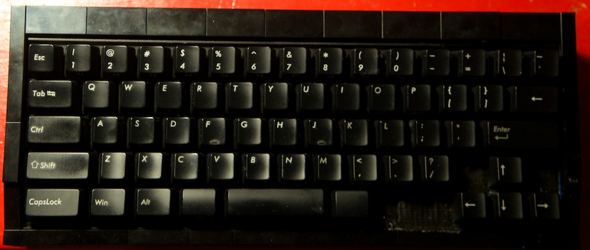
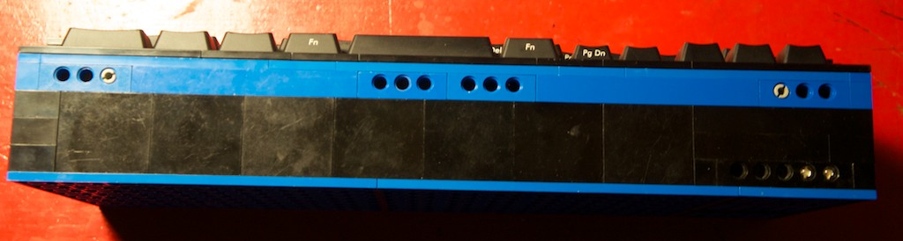
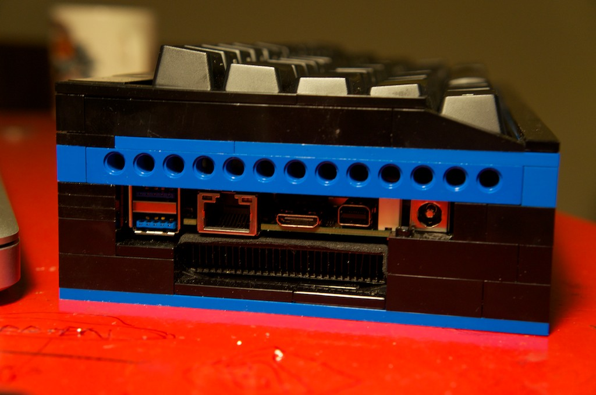
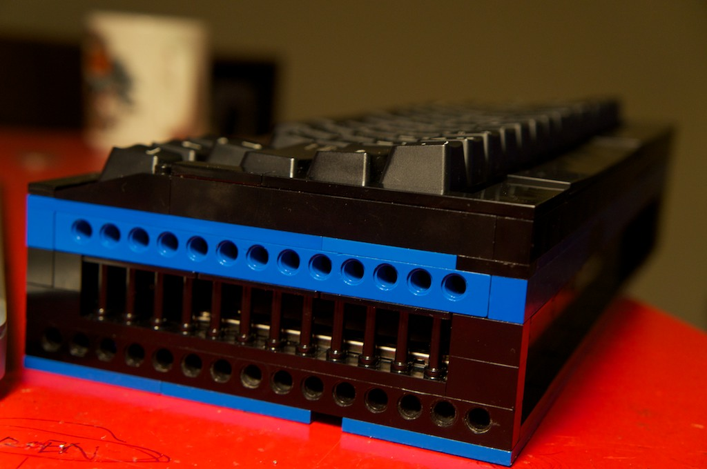

ML62 Portable Computer
======================

## 1. Overview







Taking a Filco Minila keyboard and turning it into a portable Linux
Keyboard/Computer.

The goals I have for this project are as follows:

- Real Unix Layout using Vi and Emacs shortcuts.
- Mouse Control from the keyboard.
- Use a layout that suits a Linux system nicely.
- Install a full powered computer within the keyboard chassis.
- Keyboard should be able to be used as a regular keyboard, disconnecting the
  interal computer.
- Small enough to fit into my small backpack (Eagle Industries - Yote).
- Support multiple displays.
- Support an SSD and a spinning disk.

Some things that are initially true, but may change in the future.

- No screen.
- No batteries.
- Only support Linux.

This is still a work in progress, so I wouldn't recommend you use it yet. If
you want to anyway, then add this repo as a submodule of
https://github.com/tmk/tmk_keyboard.git by doing this:

```Shell
        git clone https://github.com/tmk/tmk_keyboard.git /path/to/repo
        cd /path/to/repo
        git submodule add https://github.com/jonhiggs/ml62.git keyboards/ml62
        git submodule init
        git submodule update
```

## 2. Hardware
- Teensy 2.0
- Filco Minila
- Intel NUC motherboard
- Samsung Evo 840 250GB mSATA
- 1TB Mechanical Disk
- Intel Centrino Advanced-N 6235 Wifi Adapter.

## 3. Table of contents

1. [Hacking The Keyboard](./doc/keyboard.md)
2. [Building The Chassis](./doc/chassis.md)
3. Keyboard-Only Mode
