**THIS DOCUMENT IS A WORK IN PROGRESS. THERE WILL BE ERRORS.**

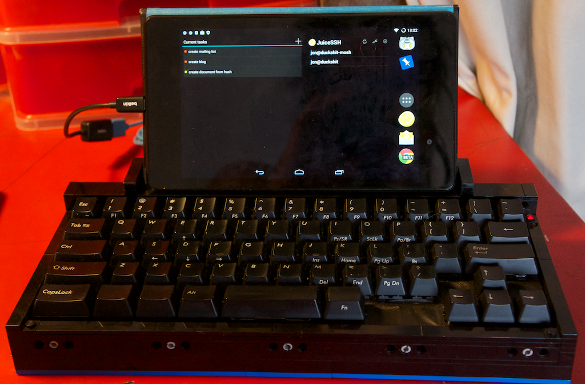

ML62 Portable Computer
======================

This project grew out of the goal to make the perfect keyboard for myself. I
already had the [Filco Minila](https://www.diatec.co.jp/en/det.php?prod_c=1322)
which I liked a lot. It has a bunch of switches at the bottom to rearrange some
of the keys about. I had it configured to resemble a [Sun Type
3](http://xahlee.info/kbd/sun_microsystems_keyboard.html) or [Happy
Hacker](http://www.pfusystems.com/embedded-keyboard/hhkb/index.html) keyboard
as much as it would allow. However there were some things that I thought could
be improved so I decided to hack.

I wanted to fix the function layer. Both Filco and Happy Hacker have completely
disregarded the old Unix shortcuts when they positioned the keys on the Fn
layer. There is a long tradition of Ctrl-A being Home and Ctrl-E being End.
Also Ctrl-D for PgDn and Ctrl-U for PgUp. To me, it seams so obvious and
ridiculous to make up entirely new combinations. I wanted to fix all the quirks
and make a real, proper hacker keyboard for Unix-like systems.


### 0.1 What Have I Built?

I've got a portable thin-client setup. My mainframe is an [Amazon EC2
instance](http://aws.amazon.com/ec2/).
My screen is a [Nexus 7
(2013)](http://en.wikipedia.org/wiki/Nexus_7_(2013_version)) and my keyboard is
running [T.M.K.](https://github.com/tmk/tmk_keyboard) firmware on a [Teensy
2.0](https://www.pjrc.com/teensy/). Yep that's Lego.

I use [JuiceSSH](https://sonelli.com/) to connect to the EC2 instance via
[Mosh](http://mosh.mit.edu/) then run my stuff inside a
[tmux](http://tmux.sourceforge.net/) session. I try and stay in the console as
much as I can, however I do find myself jumping to a browser, sometimes a lot.

It took a little bit of experimentation to work out the keymap that works best
for me. I have now settled on this layout. It works well with OS X, Android and
a Linux terminal. I have not attempted to use it under Windows or any Linux
desktop environment or window manager.


* Set <kbd>Shift</kbd>-<kbd>Esc</kbd> to send a <kbd>~</kbd>.
* Add <kbd>Fn2</kbd>-<kbd>Media</kbd> keys.
* Swap <kbd>|</kbd> and <kbd>\`</kbd> keys so they are no longer back-to-front.
* Move <kbd>Capslock</kbd> to <kbd>Fn2<kbd>-<kbd>Shift</kbd>.
* Move <kbd>Meta</kbd> next to <kbd>Space</kbd>, and right under my left thumb.
* Move <kbd>Fn1</kbd> next to <kbd>Meta</kbd>.
* Move <kbd>Super</kbd> out of the way because I use a [foot
  pedal](https://github.com/jonhiggs/fs01) for it.
* Set <kbd>Ctrl</kbd>-<kbd>H</kbd> to another <kbd>Backspace</kbd> key.
  <kbd>Ctrl</kbd>-<kbd>H</kbd> does not always act as a backspace normally,
  though I would like it to.
* Set <kbd>Ctrl</kbd>-<kbd>A</kbd> to another <kbd>Home</kbd> key. Like
  <kbd>Ctrl</kbd>-<kbd>H</kbd>, <kbd>Ctrl</kbd>-<kbd>A</kbd> does not always go
  to the start of the line. This would drive a Windows user crazy, but as I do
  not use Windows I'm not concerned.
* Remove unused keys to make the arrow keys easier to find by feel.
* <kbd>Fn1</kbd>-<kbd>hjkl</kbd> are now the alternative arrow keys.
* Set <kbd>Fn1</kbd>-<kbd>udae</kbd> to page up, page down, home and end like
  [Emacs](http://www.gnu.org/software/emacs/).
* Create a <kbd>Tmux</kbd> key which sends the Tmux prefix with one press.
* <kbd>Meta</kbd>-<kbd>Backspace</kbd> deletes a word.


### 0.3 Table Of Contents

 1. **[Hardware](#1-0)**  
  1.1 [Filco Minila](#1-1)  
  1.2 [Teensy 2.0](#1-2)  
  1.3 [Nexus 7](#1-3)  

 2. **[Hacking](#2-0)**  
  2.1 [Switch To Circuit Board Relationship](#2-1)  
  2.2 [Original Row/Column Matrix](#2-2)  
  2.3 [Compressing The Matrix](#2-3)  
  2.4 [Patching The Circuit Board](#2-4)  
  <small>
    &nbsp; 2.4.1 [Original Header](#2-4-1)  
    &nbsp; 2.4.2 [Finding Solder Points](#2-4-3)  
    &nbsp; 2.4.3 [Removing Unused Keys](#2-4-3)  
    &nbsp; 2.4.4 [Joining Columns](#2-4-4)  
  </small>
  2.5 [Connecting To The Teensy](#2-5)  
    <small>
      &nbsp; 2.5.1 [Rows](#2-5-1)  
      &nbsp; 2.5.2 [Columns](#2-5-2)  
      &nbsp; 2.5.3 [LEDs](#2-5-3)  
      &nbsp; 2.5.4 [Reset](#2-5-4)  
    </small>

 3. **[Firmware](#3-0)**  
  3.1 [Setup](#3-1)  
  3.2 [Rows And Columns](#3-2)  
  3.3 [Keymap](#3-3)  
  3.4 [LEDs](#3-4)  
  3.5 [Writing To Your Teensy](#3-5)  

 4. **[Chassis](#4-0)**  
  4.1 [Buying The Lego](#4-1)  
  4.2 [Building](#4-2)  
    <small>
      &nbsp; 4.2.1 [Frame](#4-2-1)  
      &nbsp; 4.2.2 [Mounting The Keyboard](#4-2-2)  
      &nbsp; 4.2.3 [The USB Plug](#4-2-3)  
      &nbsp; 4.2.4 [The LEDs](#4-2-4)  
      &nbsp; 4.2.5 [Teensy Button Hole](#4-2-5)  
    </small>

 5. **[Software](#5-0)**  
  5.1 [JuiceSSH](#5-1)  
  5.2 [Amazon EC2](#5-2)  
  5.3 [Mosh](#5-3)  
  5.4 [Tmux](#5-4)  

 6. **[Future](#6-0)**  

 7. **[References](#7-0)**  


## 1. Hardware<a name="1-0"></a>

### 1.1 Filco Minila<a name="1-1"></a>

I choose the
[Minila](https://www.diatec.co.jp/en/det.php?prod_c=1322) originally because I
wanted a small mechanical keyboard.  I didn't have any mechanical keyboard at
that time and I loved that it could be configured like the Happy Hacker. I
decided against the Happy Hacker because it's too expensive to not use. I've
heard the Topre switches are similar to the Cherry Browns which I don't like.

My hardware is marked as revision `Matrix Ver1.0 2012/10/17`. If your hardware
says anything else, there's no knowing what is different. Maybe nothing, maybe
everything. Either way, with this guide you should be able to hack it anyway.


Dimensions...


### 1.2 Teensy 2.0<a name="1-2"></a>

I originally got a Teensy 3.0. It didn't work because it's a different
architecture. I also tried an Arduino Leopold which I had laying around. It
didn't work either. Some of the pins worked, but not enough of them. I then
ordered what I should have got in the first place. Everything went smooth with
the Teensy 2.0.

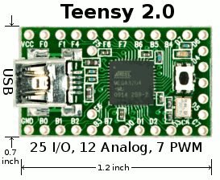


### 1.3 Nexus 7<a name="1-3"></a>

This was an experiment I tried out because I had the tablet laying around and
thought I should see how it went as a display. I wasn't very impressed
initially, but after persevering for a little while, I sorted out most of my
problems.

I'm using an OTG cable to connect the keyboard to the tablet's USB port.

I'm getting internet via Wifi or tethering from my phone.


## 2. Hacking<a name="2-0"></a>

These instructions are for hacking a Filco Minila. The revision that I am
using is `Matrix Ver1.0 2012/10/17`. These instructions may be compatible with
other revisions, however I cannot promise anything as I don't have the hardware
to check. It should become apparent quite early if your revision is different.
If you notice no differences in the [switch to circuit board
relationship](#2-1), then you should be okay.


### 2.1 Switch To Circuit Board Relationship.<a name="2-1"></a>

For now I'm going to refer to the keys, not by the label that is written on
them, but by the position within the [keymap](../keymap_common.h) that they
will be placed. Initially we don't need to worry ourselves about what they key
will do. All that matters is to recognise that the key exists.

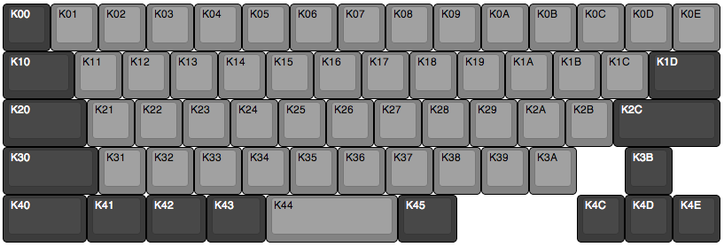

First up, we need to work out how each switch is connected to the original
matrix. If you don't have a strong grasp of how a keyboard works I recommend
you read [Keyboard Matrix Help](http://www.dribin.org/dave/keyboard/one_html/).


| Key | **K00** | **K01** | **K02** | **K03** | **K04** | **K05** | **K06** | **K07** | **K08** | **K09** | **K0A** | **K0B** | **K0C** | **K0D** | **K0E** |
|-----|---------|---------|---------|---------|---------|---------|---------|---------|---------|---------|---------|---------|---------|---------|---------|
| Col | C1      | C1      | C2      | C3      | C4      | C4      | C5      | C5      | C6      | C7      | C8      | C8      | C6      | C1      | C10     |
| Row | R3      | R7      | R7      | R7      | R7      | R6      | R6      | R7      | R7      | R7      | R7      | R6      | R6      | R6      | R1      |

| Key | **K10** | **K11** | **K12** | **K13** | **K14** | **K15** | **K16** | **K17** | **K18** | **K19** | **K1A** | **K1B** | **K1C** | **K1D** | **Kxx** |
|-----|---------|---------|---------|---------|---------|---------|---------|---------|---------|---------|---------|---------|---------|---------|---------|
| Col | C1      | C1      | C2      | C3      | C4      | C4      | C5      | C5      | C6      | C7      | C8      | C8      | C6      | C10     |         | 
| Row | R1      | R0      | R0      | R0      | R0      | R1      | R1      | R0      | R0      | R0      | R0      | R1      | R1      | R2                |

| Key | **K20** | **K21** | **K22** | **K23** | **K24** | **K25** | **K26** | **K27** | **K28** | **K29** | **K2A** | **K2B** | **K2C** | **Kxx** | **Kxx** | 
|-----|---------|---------|---------|---------|---------|---------|---------|---------|---------|---------|---------|---------|---------|---------|---------|
| Col | C2      | C1      | C2      | C3      | C4      | C4      | C5      | C5      | C6      | C7      | C8      | C8      | C10     |         |         |
| Row | R1      | R2      | R2      | R2      | R2      | R3      | R3      | R2      | R2      | R2      | R2      | R3      | R4      |         |         |

| Key | **K30** | **K31** | **K32** | **K33** | **K34** | **K35** | **K36** | **K37** | **K38** | **K39** | **K3A** | **K3B** | **Kxx** | **Kxx** | **Kxx** |
|-----|---------|---------|---------|---------|---------|---------|---------|---------|---------|---------|---------|---------|---------|---------|---------|
| Col | C15     | C1      | C2      | C3      | C4      | C4      | C5      | C5      | C6      | C7      | C8      | C14     |         |         |         |
| Row | R1      | R4      | R4      | R4      | R4      | R5      | R5      | R4      | R4      | R4      | R5      | R3      |         |         |         | 

| Key | **K40** | **K41** | **K42** | **K43** | **K44** | **K45** | **Kxx** | **Kxx** | **Kxx** | **Kxx** | **Kxx** | **Kxx** | **K4C** | **K4D** | **K4E** |
|-----|---------|---------|---------|---------|---------|---------|---------|---------|---------|---------|---------|---------|---------|---------|---------|
| Col | C0      | C13     | C9      | C9      | C11     | C9      |         |         |         |         |         |         | C14     | C11     | C12     |
| Row | R6      | R1      | R3      | R2      | R3      | R0      |         |         |         |         |         |         | R5      | R5      | R5      | 

     
     
### 2.2 Original Row/Column Matrix<a name="2-2"></a>

Using the data we collected in the previous step, we can now construct a table
to help us visualise the matrix.


|     |  0  |  1  |  2  |  3  |  4  |  5  |  6  |  7  |  8  |  9  | 10  | 11  | 12  | 13  | 14  | 15  |
|-----|-----|-----|-----|-----|-----|-----|-----|-----|-----|-----|-----|-----|-----|-----|-----|-----|
|**0**|     | K11 | K12 | K13 | K14 | K17 | K18 | K19 | K1A | K45 |     |     |     |     |     |     |
|**1**|     | K10 | K20 |     | K15 | K16 | K1C |     | K1B |     | K0E |     |     | K41 |     | K30 |
|**2**|     | K21 | K22 | K23 | K24 | K27 | K28 | K29 | K2A | K43 | K1D |     |     |     |     |     |
|**3**|     | K00 |     |     | K25 | K26 |     |     | K2B | K42 |     | K44 |     |     | K3B |     |
|**4**|     | K31 | K32 | K33 | K34 | K37 | K38 | K39 |     |     | K2C |     |     |     |     |     |
|**5**|     |     |     |     | K35 | K36 |     |     | K3A |     |     | K4D | K4E |     | K4C |     |
|**6**| K40 | K0D |     |     | K05 | K06 | K0C |     | K0B |     |     |     |     |     |     |     |
|**7**|     | K01 | K02 | K03 | K04 | K07 | K08 | K09 | K0A |     |     |     |     |     |     |     |


As you can see, the matrix has 8 rows and 16 columns.

### 2.3 Compressing The Matrix.<a name="2-3"></a>

The first thing you need to understand is that for each row, column and LED
requires one pin on your controller; in our case, the Teensy. The purpose of
compressing the matrix is to join columns together so that you don't require so
many pins on your controller. Compressing is completely optional, however as
I'm using a Teensy 2.0 with only 25 pins, I will have no room to expand once
I've added a single LED.

To determine which columns can be merged is quite simple. If you can place a
column on top of another without any keys sharing a position, then they can be
merged.

For example:

* Column 15 can be merged with Column 0, 3, 7, 9, 11, 12 or 14.

* Column 4 and 5 are completely full so they cannot be merged with anything.


**Matrix after compressing:**

| COL1 |  1  |  0  |  3  |  4  |  5  |  6  |  7  |  8  |  9  | 10  |
| COL2 | 12  |  2  | 13  |     |     |     | 15  |     |     |     |
| COL3 |     | 11  | 14  |     |     |     |     |     |     |     |
|------|-----|-----|-----|-----|-----|-----|-----|-----|-----|-----|
|**0** | K11 | K12 | K13 | K14 | K17 | K18 | K19 | K1A | K45 |     |
|**1** | K10 | K20 | K41 | K15 | K16 | K1C | K30 | K1B |     | K0E |
|**2** | K21 | K22 | K23 | K24 | K27 | K28 | K29 | K2A | K43 | K1D |
|**3** | K00 | K44 | K3B | K25 | K26 |     |     | K2B | K42 |     |
|**4** | K31 | K32 | K33 | K34 | K37 | K38 | K39 |     |     | K2C |
|**5** | K4E | K4D | K4C | K35 | K36 |     |     | K3A |     |     |
|**6** | K0D | K40 |     | K05 | K06 | K0C |     | K0B |     |     |
|**7** | K01 | K02 | K03 | K04 | K07 | K08 | K09 | K0A |     |     |


**From now on I'll reference the columns like so:**

|     |  0  |  1  |  2  |  3  |  4  |  5  |  6  |  7  |  8  |  9  |
|-----|-----|-----|-----|-----|-----|-----|-----|-----|-----|-----|
|**0**| K11 | K12 | K13 | K14 | K17 | K18 | K19 | K1A | K45 |     |
|**1**| K10 | K20 | K41 | K15 | K16 | K1C | K30 | K1B |     | K0E |
|**2**| K21 | K22 | K23 | K24 | K27 | K28 | K29 | K2A | K43 | K1D |
|**3**| K00 | K44 | K3B | K25 | K26 |     |     | K2B | K42 |     |
|**4**| K31 | K32 | K33 | K34 | K37 | K38 | K39 |     |     | K2C |
|**5**| K4E | K4D | K4C | K35 | K36 |     |     | K3A |     |     |
|**6**| K0D | K40 |     | K05 | K06 | K0C |     | K0B |     |     |
|**7**| K01 | K02 | K03 | K04 | K07 | K08 | K09 | K0A |     |     |


### 2.4 Patching Into The Circuit Board.<a name="2-4"></a>

There are two ways you can go about patching the board:

1. Get a plug that will attach to the original circuit board.  
2. Connect straight to points on the board.

#### 2.4.1 Original Header.<a name="2-4-1"></a>

I was going to go the first way, but the plug I bought did not fit so I decided
to just go ahead without it. If you do decide to connect to the board, you need
a 28 pin male connector with 2mm spacing. Be aware that the Teensy has 2.54mm
spaced pins so the two will be a bit of a pain to connect.

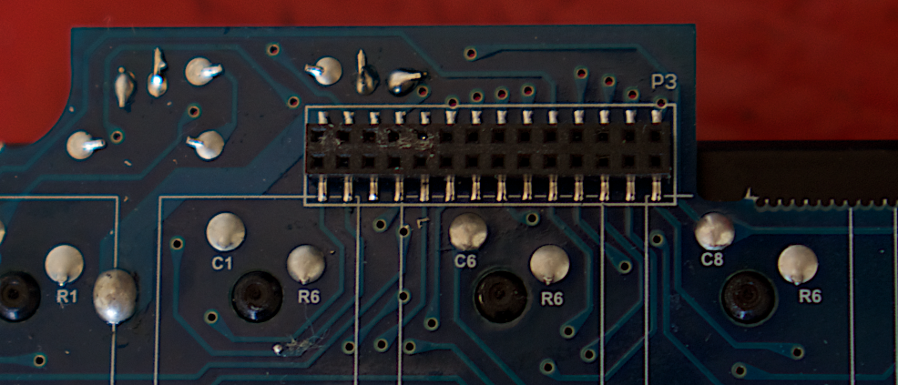

**The pinout of the original header:**

| 28/27 | 26/25 | 24/23 | 22/21 | 20/19 | 18/17 | 16/15 | 14/13 | 12/11 | 10/09 | 08/07 | 06/05 | 04/03 | 02/01 |
|-------|-------|-------|-------|-------|-------|-------|-------|-------|-------|-------|-------|-------|-------|
| GND   | C12   | C11   | C10   | C9    | C8    | C7    | C6    | C5    | C4    | C3    | C2    | C1    | C0    |
| OC13  | LED1  | LED2  | +5v   | C15   | C14   | R7    | R6    | R5    | R4    | R3    | R2    | R1    | R0    |


#### 2.4.2 Finding Solder Points

1. Find a point on the board labeled R0.
2. Connect your multimeter to the R0 pin of the original header.
3. Running between the switches are the diodes. You cannot see them, but their
pins are exposed. Check the diodes surrounding the switch for a connection back
to the header. Once you have found one, that can be used as a point to take
your connection.

For each of the switches there is a diode. You need to make sure that you take
your connection from the other side of it. I found testing with a multimeter to
be a bit difficult but managed by using the following process:

1. Find a switch.
1. Find the next component that the switch is connected to. Do this by checking
the surrounding unlabeled points for zero resistance.
1. Finding the other leg of that component should be quite obvious. Just look
for another point at right angles to the first point that has zero resistance
back to one of the pins of the original header.
1. Your connection point can be the pin of the original header, or any point on
the board that is connected to that header, including the leg of the component
you just found.

!!!!!To help, here is the pin-out of the original header.

| 28/27 | 26/25 | 24/23 | 22/21 | 20/19 | 18/17 | 16/15 | 14/13 | 12/11 | 10/09 | 08/07 | 06/05 | 04/03 | 02/01 |
|-------|-------|-------|-------|-------|-------|-------|-------|-------|-------|-------|-------|-------|-------|
| GND   | C12   | C11   | C10   | C9    | C8    | C7    | C6    | C5    | C4    | C3    | C2    | C1    | C0    |
| OC13  | LED1  | LED2  | +5v   | C15   | C14   | R7    | R6    | R5    | R4    | R3    | R2    | R1    | R0    |

Once that's all done, all that's left is soldering up some leads to each of
your connection points.

!!!I've connected my board to some connectors which will plug straight into my
breadboard. The connectors got like this.

Pin | 0 | 1 | 2 | 3 | 4 | 5 | 6 | 7 |
----|---|---|---|---|---|---|---|---|
Row | 0 | 1 | 2 | 3 | 4 | 5 | 6 | 7 |

Pin | 0 | 1 | 2 | 3 | 4 | 5 | 6 | 7 | 8 | 9 |
----|---|---|---|---|---|---|---|---|---|---|
Col | 0 | 1 | 2 | 3 | 4 | 5 | 6 | 7 | 8 | 9 |

#### 2.4.3 Removing Unused Keys

By now you should know which keys you want to remove. You should do so now
before your board gets delicate from dangling wires.

**IMPORTANT: If you decide to remove keys, and you have compressed your matrix,
you may have to start again if you change your mind and want to add a key back
in.**

#### 2.4.4 Joining Columns

Now it's time to get out the soldering iron and physically connect those rows
up. So start by finding a C1 and a C12 on the circuit board and short them out.
Then connect C0, C2 and C11 together. Then continue for the rest.

### 2.5 Connecting to the Teensy.

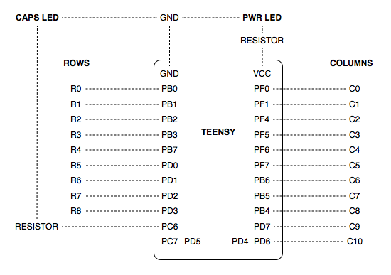


#### 2.5.1 Rows<a name="2-5-1"></a>

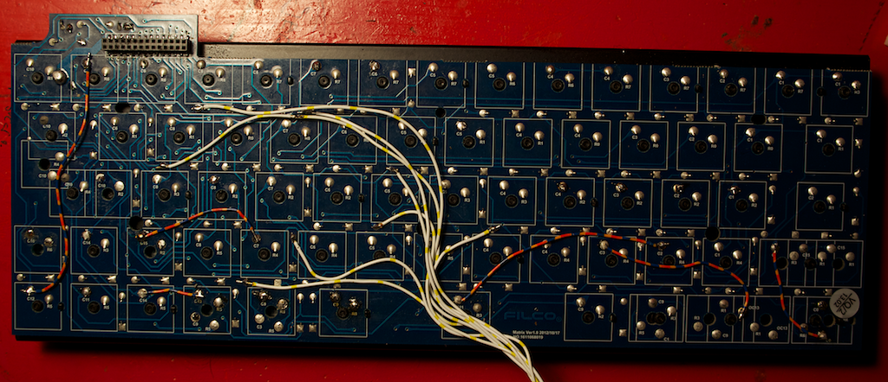

#### 2.5.2 Columns<a name="2-5-2"></a>

!!!Find any point on the board and with the label.

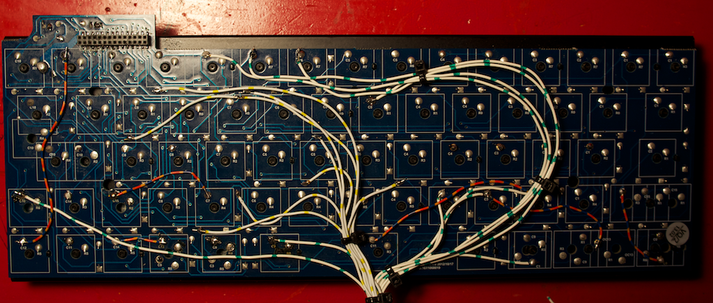

#### 2.5.3 LEDs<a name="2-5-3"></a>

#### 2.5.4 Reset<a name="2-5-4"></a>

To program the Teensy, you must first press the reset button. Once you've built
a case around your keyboard, it may be difficult to reach. If you wish, you can
place another button somewhere else where it's easier to reach.

!!! explain how...


## 3. Firmware
* [Teensy 2.0](https://www.pjrc.com/teensy/)

!!! In spite the pins on each of the keys being name Cn and Rn, that does not mean
that they are the rows and columns. In fact, it's actually the other way
around. I needed to reverse this behaviour due to incorrect polarity coming
from the Teensy which prevented the signal to pass the diode on the Minila
circuit board.

### 3.1 Setup<a name="3-1"></a>

Getting the source:
```shell
git clone ... <path>
cd <path>
git submodule add ... keyboards/ml62
cd keyboards/ml62
```

### 3.2 Rows And Columns
See [matrix.c](../matrix.c).

### 3.3 Keymap
See [keymap_plain.c](../keymap_plain.c).
See [keymap_common.h](../keymap_common.h).

### 3.4 LEDs

Configuring the LEDs


### 3.5 Writing To Your Teensy<a name="3-5"></a>

First you need to compile your source.

```shell
# Setting the path is a hack and pretty specific to my own setup. I'm only putting it here so I don't forget.
PATH=/Applications/Arduino.app/Contents/Resources/Java/hardware/tools/avr/bin:${PATH}
cd keyboards/ml62
make clean
make
```

Then open up the `teensy` app and flash `ml62_lufa.hex` to your teensy.


## 4. Chassis<a name="4-0"></a>

I didn't know initially what size or shape I wanted. I had a quick look at what
dimensions a Lego brick is, and I worked out pretty quick that Lego is ideal
for quick mock ups. The dimensions of Lego seems to fit a lot of electronics
perfectly and it's easy to work the plastic with not much more than a few
jewellers files.

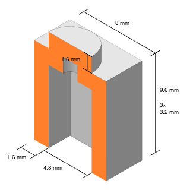

I was concerned that maybe it would fall apart, but so far that hasn't been a
problem. A few pieces come off from time to time and I'll find them in the
bottom of my bag. Sometimes cracks will appear but it's been much stronger than
I expected.

If you are still concerned, I have read that you can [permanently
bond](http://bricks.stackexchange.com/questions/1037/what-glue-should-i-use-for-permanent-lego-construction)
blocks together using acetone, although I have not tried it myself.


### 4.1 Buying The Lego<a name="4-1"></a>

I first used [Bricksmith](http://bricksmith.sourceforge.net/) to attempt to
build my chassis. I would not recommend it. The program is nice, but it was a
waste of time to do much more than get an idea of how much Lego I needed to
buy. 

1. I was over-engineering because I was underestimating the strength of the
bricks.
2. It was so slow to change your mind and try something new.
3. Anything with angles was difficult.
4. Its hard to hack your bricks with a file or drill.
5. Without the actual components you are trying to fit into Lego, modelled and
imported into your CAD program, it was ultimately just guess work anyway.

So do what you have to do to decide what to buy, then head over to
[bricklink](http://www.bricklink.com/) and buy double or more. For the amount
of Lego you need for a keyboard it isn't expensive to buy too much.

I found Lego much easier to work with than Bricksmith and 
around 70 Euro for 3 to 4 times as much as I needed.


### 4.2 Building<a name="4-2"></a>

#### 4.2.1 Frame

The keyboard backplate is exactly 36 bricks wide

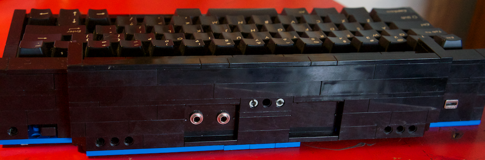
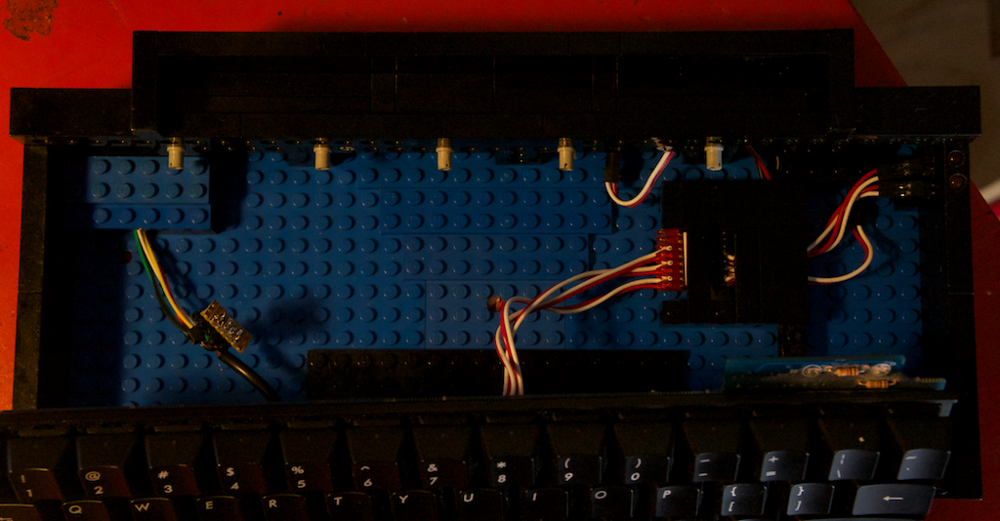
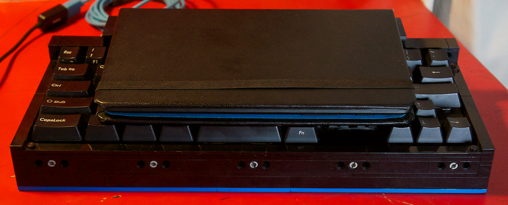

#### 4.2.2 Mounting The Keyboard


#### 4.2.3 The USB Plug

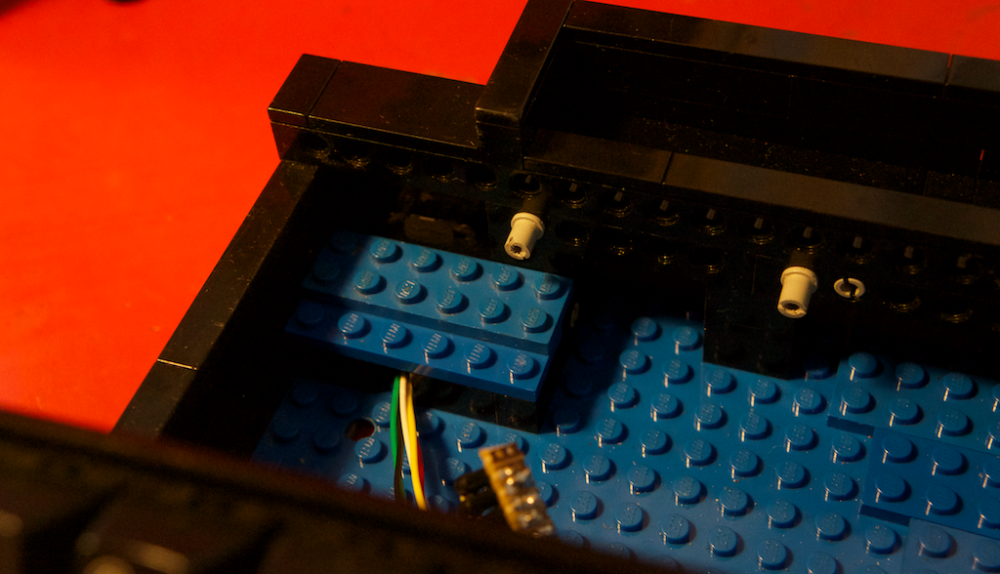
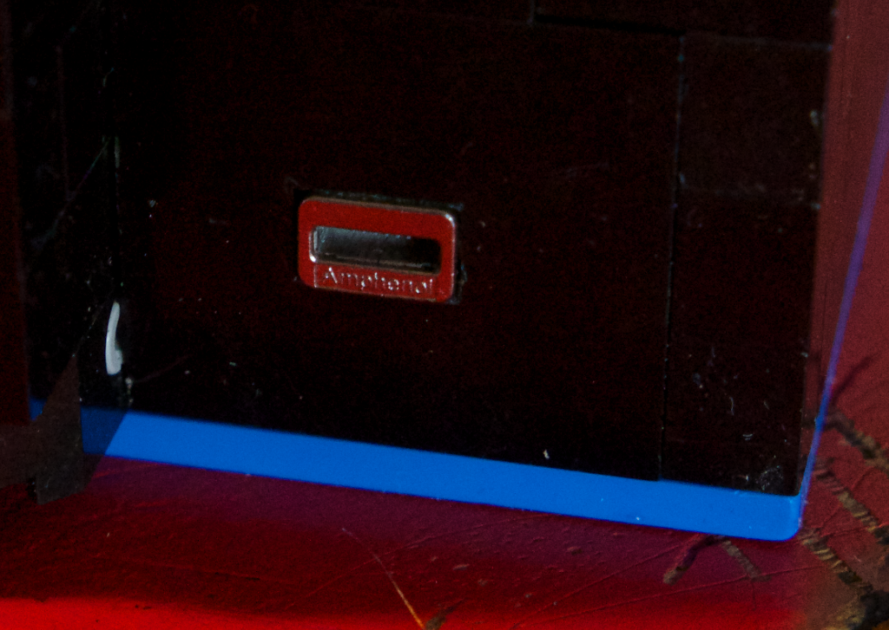

#### 4.2.4 The LEDs

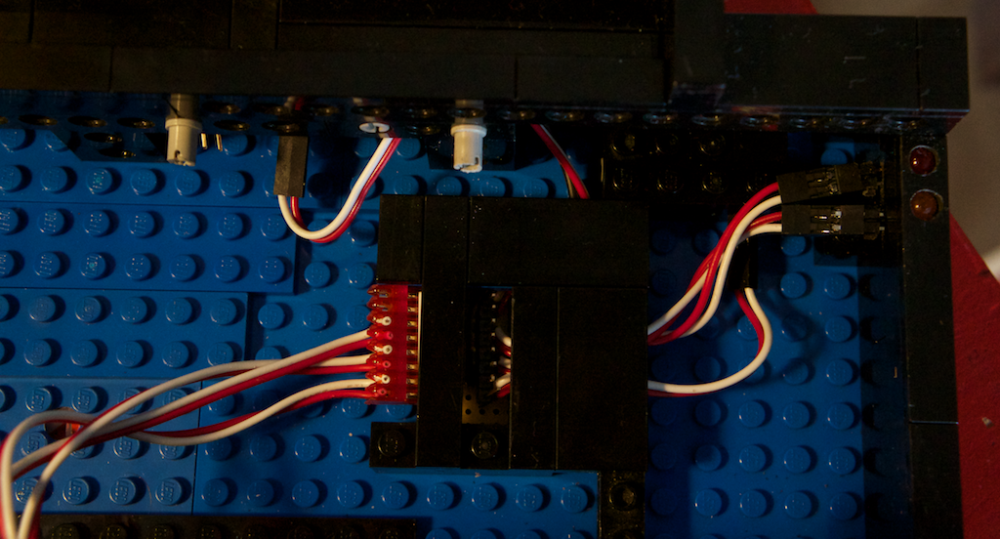

#### 4.2.5 Teensy Flash Button

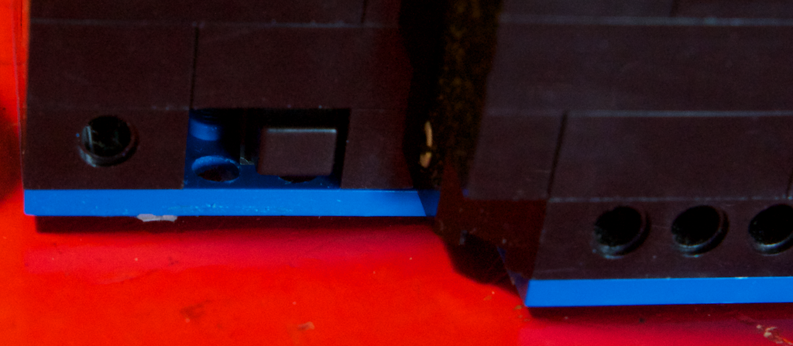

## 5. Software<a name="5-0"></a>

### 5.1 Amazon EC2<a name="5-1"></a>

1. Boot up an EC2 instance.
2. Configure an Elastic IP
3. Point a DNS record to your Elastic IP
4. Open up ports ... to allow yourself SSH access.


### 5.2 JuiceSSH<a name="5-2"></a>

JuiceSSH is an awesome SSH client for Android. It's lacking in a few features
I'd really like to see, but they are steadily progressing so I'm confident that
it'll just be a matter of time before I'm completely satisfied.

1. Configure to SSH into the DNS record your created.


### 5.3 Mosh<a name="5-3"></a>

I highly recommend using Mosh instead of SSH, especially if you are using a
Tmux key. I'm not sure the exact reason, but multiple Tmux key-presses do not
register correctly with regular SSH.

1. [Install Mosh](http://mosh.mit.edu/#getting) on your EC2 instance.
2. Open up ports...
3. Configure JuiceSSH.

Notes:

* Mosh does not yet forward SSH keys. Any SSH keys you require on your EC2
  instances will need to be installed in `~/.ssh`.


### 5.4 Tmux<a name="5-4"></a>

Tmux stands for 'Terminal Multiplexer'. If you are familiar with `screen`, then
it's a modern version of that. If not, then it's a way to display multiple
terminals simultaneously. It give you keyboard control over their position and
size. You can split your display or have a series of tabs or a combination of
both. You can background your session and continue on another machine and you
can share your terminal with multiple users.

[tmux is sweet as heck](http://eev.ee/blog/2012/03/21/tmux-is-sweet-as-heck/)
is a good overview of the differences between Tmux and Screen.

1. Install it via your system package manager. It should be available.
2. `tmux` will create a new session and `tmux a` will attach you to an existing
session.

That should be enough to get you started.

The config I'm using is on
[github](https://github.com/jonhiggs/dotfiles/blob/master/.tmux.conf). You will
need to save it to `~/.tmux.conf`

### 5.5 Now what?

Now you have a Linux terminal. You'll need to get command-line tools to do what
you want to do. There is plenty written on the web about this, I won't repeat
it. My work-flow revolves around these tools:

* Vim
* Tig and Git
* the-silver-searcher

## 6. Future

I'm not finished yet, but it's becoming clear that I'll probably never finish.
I'm using my new keyboard every day and am satisfied with it, there may be some
minor changes along the way, but layout seems perfect.

Ultimately I'd like to build a replacement laptop. It doesn't matter if I'm
still using EC2 for most of my computing power. I think a local Linux
installation with Fluxbox would make a better window manager than Android
though. I'm imagining something like this:

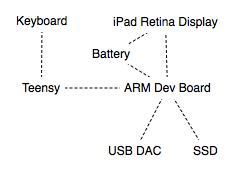

For the short term, I'd like to be able to charge the Nexus while I've got a
keyboard connected. I should also mount the screen a little bit more sturdy.  A
rubber mat on the base would be nice to stop it from sliding around. I may also
look into getting some nice new key-caps with the actual keys printed on them.
