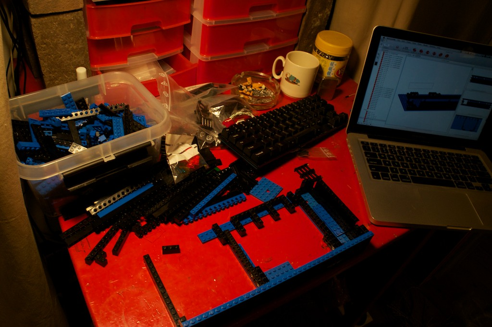

Building The Chassis
====================

## 1. Overview

I'm going to be building the chassis out of Lego. It's cheap, strong, versatile
and easy to work. Oh, and it looks awesome of course.

I started by building a model in Brickbuilder, then bought 3x the number of
parts that it said I needed. I figured that would give me the bricks that I
needed to make any changes needed, and also be able to have make modifications
without having to disassemble what I had.

As it turns out, that was a good idea. The model that I built was no good, and
required substantial changes to make the hardware sit firm. When I settle on a
model, I might build it up in Brickbuilder and share the model.

For now, as the case is going through many changes, I'm going to just share
some photos of it in various stages of completion.

## 2. Photos

### 2.1. Version 1

I don't have too many photos of this version. It was too big and it didn't last
long before I'd decided to rebuild it.

### 2.2. Beginnings of Version 2.

Knowing what I didn't like about the initial version, I set about making the
keyboard fit nicer into a smaller frame.

The extra lego came in real handy here.

As you can see, I've reduced the depth at the back of the keyboard from four
bricks, down to two.

Then I started filing down the Technic pins so that the keyboard is held up by
it's steel backplate, rather than the PCB.

The original had a problem where the was not enough airflow for the fan. Also
upon checking the motherboard manual, there were a bunch of power regulators
that were covered and going to receive no airflow.

Using the wedges I was able to prop up the motherboard to a pretty good height.
Just enough for some air, but a little as possible to keep the profile low.

And then I built in the LEDs. The power and HDD are on one LED. The second LED
is for capslock.
